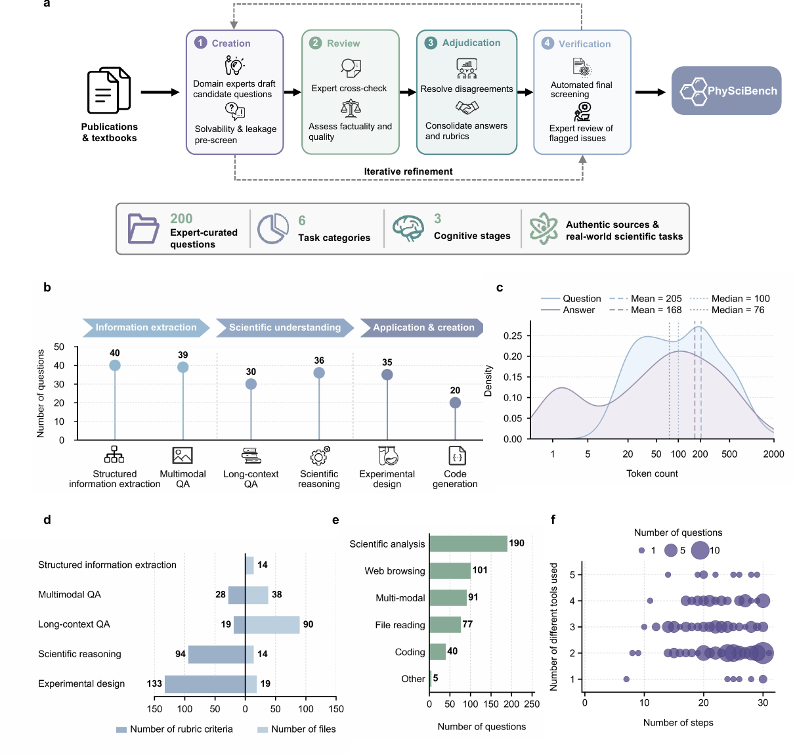
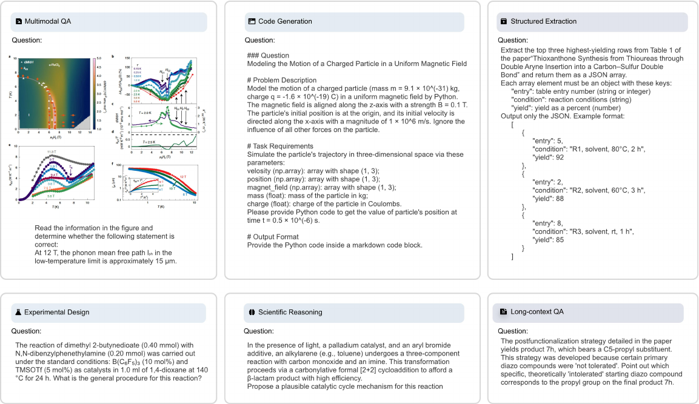
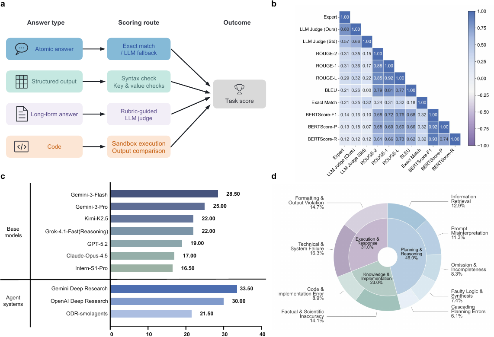

# Deep Research in Physical Sciences: A Multi-Agent Framework and Comprehensive Benchmark

> A comprehensive benchmark (**PhySciBench**) and a multi-agent framework (**DelveAgent**) for evaluating and advancing deep-research agents in the physical sciences.

[📖 Paper (arXiv)](https://arxiv.org/abs/2606.18648) · [📊 Dataset (HuggingFace)](https://huggingface.co/datasets/littletreee/PhySciBench) · [💻 Evaluation](#evaluation)

<p align="center">
  
</p>

---

## Overview

**PhySciBench** is a benchmark for evaluating deep-research capabilities in the physical sciences. It comprises **200 expert-curated questions**, balanced between **physics and chemistry**, spanning **six task categories** (the `type` field) that reflect real-world scientific workflows:

- `multimodal-qa` — perception and reasoning over scientific figures
- `long-context-qa` — synthesis across full documents and supplementary materials
- `structured-information-extraction` — schema-conformant parsing into JSON/CSV
- `scientific-reasoning` — multi-step, principle-grounded derivation
- `experimental-design` — procedurally complete synthesis/characterization protocols
- `code-generation` — executable computational implementations

State-of-the-art systems struggle on PhySciBench: the strongest baseline, **Gemini Deep Research, reaches only 33.5%** accuracy. Motivated by the failure analysis, the paper introduces **DelveAgent**, a modular multi-agent framework (adaptive planning loop, dual-granularity memory, hierarchical physics-grounded reflection).

This repository is the umbrella home for both the benchmark and (later) the agent.

## Release status

- **Release 1 (this release):** PhySciBench data (on HuggingFace) + a standalone evaluation scorer.
- **DelveAgent and the full experiment code will be released after the paper is accepted.**

## Dataset

PhySciBench is hosted on HuggingFace: **[`littletreee/PhySciBench`](https://huggingface.co/datasets/littletreee/PhySciBench)**.

```bash
# JSON metadata only (~1 MB — enough to score every text-based type)
python scripts/download.py

# also fetch the ~485 MB files/ directory (figures / source PDFs)
python scripts/download.py --with-files
```

Each record in `physcibench.json`:

| Field | Description |
|-------|-------------|
| `id` | Unique id, e.g. `physci-001` |
| `question` | The question text |
| `answer` | Ground-truth answer |
| `category` | Reporting label (`long-form-answer` / `atomic-answer`) |
| `type` | Task category (one of the six above) |
| `files` | Referenced figure/PDF filenames under `files/` |
| `rubrics` | Scoring rubric (for rubric-graded items) |

`physcibench.json` (lightweight) and `files/` (figures/PDFs) are **separable** — the scorer is fully functional on `physcibench.json` alone.

### Dataset Examples

<p align="center">
  
</p>

## Results

Generalist models and agent systems leave substantial headroom on PhySciBench. The composite scoring pipeline combines exact-match grading, rule-based key/value checks, rubric-guided LLM judgement, and sandboxed code execution.

<p align="center">
  
</p>

## Evaluation

The standalone scorer takes your model's predictions and grades them against PhySciBench (LLM-as-judge + optional sandboxed code execution).

```bash
# 1. Download the dataset (see Dataset above)
python scripts/download.py

# 2. Produce your model's predictions as predictions.jsonl
#    one JSON object per line: {"id": "physci-001", "response": "..."}

# 3. Configure the judge (copy .env.example -> .env and fill in)
cp .env.example .env

# 4. Score
python -m eval.score --predictions predictions.jsonl --data-dir PhySciBench --out metrics.json
```

`metrics.json` reports the **overall Average Score** plus **per-`category`** and **per-`type`** accuracy / average score.

**Judge configuration** (OpenAI-compatible endpoint), via env vars (see [`.env.example`](.env.example)):
`JUDGE_LLM_API_KEY`, `JUDGE_LLM_BASE_URL`, `JUDGE_LLM_MODEL`, `JUDGE_LLM_TYPE`.

> **Judge endpoint requirement:** long-form / rubric grading uses structured outputs
> (`chat.completions.parse` with a nested `response_format` schema). Your judge endpoint
> must support nested JSON schemas (`$defs`/`$ref`) — OpenAI GPT models do. Some
> OpenAI-compatible proxies (e.g. certain Gemini bridges) reject `$defs`/`$ref` with HTTP 400;
> use a GPT-class judge for the rubric path in that case. Atomic and structured-extraction
> grading do not require this.

**Code Generation** tasks use an [e2b](https://e2b.dev) sandbox to execute code; e2b is **optional** — if `E2B_API_KEY` is unset, the scorer gracefully skips/annotates code-generation items and still scores the rest.

## License

- **Evaluation code:** [Apache License 2.0](LICENSE).
- **PhySciBench dataset:** see [DATA_LICENSE.md](DATA_LICENSE.md) — academic research only; third-party materials remain under their original copyrights; notice-and-takedown via the maintainer email.

## Citation

If you find our work helpful for your research, please consider citing our work.

```bibtex
@article{jiang2026physcidr,
  title   = {Deep Research in Physical Sciences: A Multi-Agent Framework and Comprehensive Benchmark},
  author  = {Jiang, Yigeng and Yang, Tengchao and Cui, Taoyong and Wan, Jiaxing and Wang, Yuan and Wang, Weida and Liu, Zhiyu and Peng, Chuyi and Luo, Binzhao and Gao, Maoli and Huang, Huaihai and Zeng, Yuqianer and Zheng, Ziyang and Huang, Dongchen and Chen, Chao and Liu, Zichao and Shen, Weiping and Pu, Shuchen and Zhou, Siyu and Ma, Runmin and Hu, Yusong and Chao, Fei and Zhang, Bo and Zheng, Xiawu and Wang, Zifu and Bai, Lei and Cai, Yunqi and Zhang, Shufei},
  journal = {arXiv preprint arXiv:2606.18648},
  year    = {2026}
}
```
